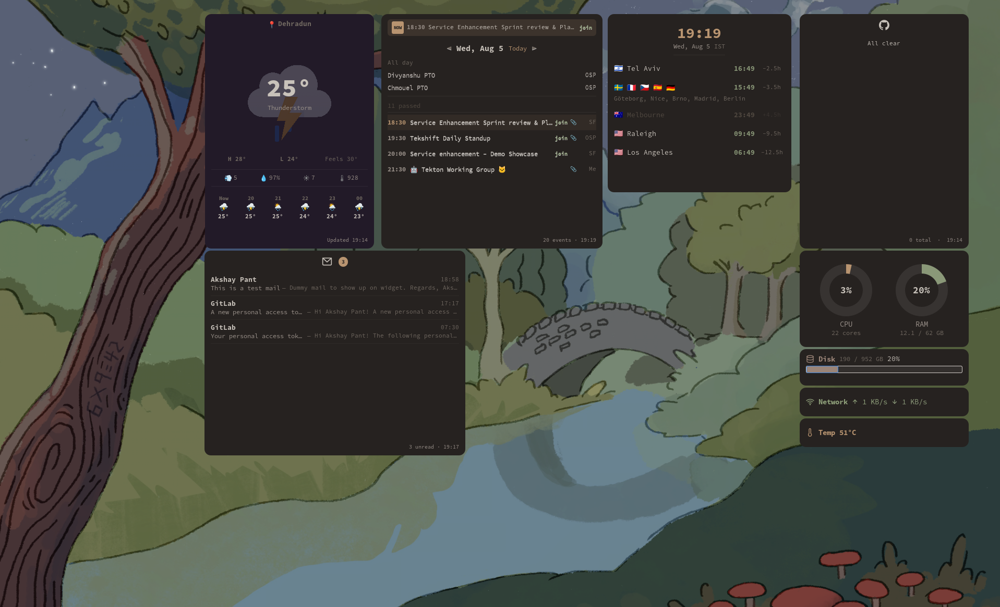

# nook

> **Work in progress** — more widgets will be added as needs come up.

My desktop widgets for GNOME, built with [eww](https://github.com/elkowar/eww). They sit behind all windows as part of the wallpaper — always visible, never in the way.

Working across multiple time zones, calendars, and GitHub repos daily; instead of constantly switching between browser tabs and apps to check the time in another city, join my next standup, or see if someone requested a review — I built these to keep everything in my peripheral vision.

<p align="center"></p>

---

## Widgets

### GitHub Notifications

Pulls notifications from `gh` CLI and groups them by reason — mentions, review requests, assignments, CI failures. Click any item to open it in the browser. Refreshes every 15 minutes.

### Google Calendar


Aggregates events across my work calendars. Past events collapse into a count so current and upcoming meetings stay at the top. Events starting soon get an alert banner with a countdown and a one-click join button. Clicking a title expands it to show the time range, attachments, and a link to the full event. Navigate days with arrow buttons or jump back to today.

Reuses OAuth credentials from [tsk](https://github.com/theakshaypant/tsk), my CLI task manager.

### System Stats

Circular gauges for CPU and RAM, a progress bar for disk, live network throughput, and CPU temperature. All from eww's built-in variables — no external scripts needed.

### Weather

Current conditions with an animated icon overlay, high/low/feels-like, wind, humidity, UV index, and pressure. A 12-hour hourly forecast scrolls horizontally at the bottom. The card background shifts based on weather condition and time of day.

Set your city in `config.yaml` — location is resolved via Open-Meteo's geocoding API. Refreshes every 15 minutes.

Weather data by [Open-Meteo.com](https://open-meteo.com/) ([CC BY 4.0](https://creativecommons.org/licenses/by/4.0/)). Weather icons from [Meteocons](https://github.com/basmilius/weather-icons) (MIT).

### Gmail

Unread inbox emails with sender, subject, and snippet. Click any email to open it in Gmail. Uses Google OAuth with `gmail.readonly` scope — run `scripts/auth_gmail.sh` once to authorize. Refreshes every 10 minutes.

Reuses the same Google Cloud project credentials as the calendar widget, but maintains its own token file.

### World Clock

Local time plus nine cities my team is spread across. Same-timezone cities are grouped. Night hours are dimmed. Click any time to enter edit mode and preview what a given hour looks like in every zone — handy for scheduling across continents.

---

## Running it

eww needs to be built with X11 support since GNOME doesn't support wlr-layer-shell:

```
cargo build --release --no-default-features --features=x11
```

Dependencies: `jq`, `curl`, [`gh`](https://cli.github.com/) (authenticated), and Google OAuth credentials for calendar and Gmail (see [tsk](https://github.com/theakshaypant/tsk)).

```
git clone https://github.com/theakshaypant/nook.git
cd nook
./nook.sh start
```

To stop everything:

```
./nook.sh stop
```

### Configuration

Copy `config.yaml` and adjust:

```yaml
weather:
  city: "Berlin"

calendar:
  credentials_file: "~/.config/tsk/work_credentials.json"
  token_file: "~/.config/tsk/work_token.json"
  calendars:
    - id: "user@example.com"
      name: "Work"
    - id: "Team Calendar"
      name: "Team"

gmail:
  credentials_file: "~/.config/tsk/work_credentials.json"
  token_file: "~/.config/nook/gmail_token.json"

watch:
  cities:
    - name: "Berlin"
      timezone: "Europe/Berlin"
      flag: "🇩🇪"
```

For Gmail, enable the Gmail API in your Google Cloud project and run `scripts/auth_gmail.sh` to authorize.

---

## Adding a new widget

1. Create `widgets/<name>.yuck` and `widgets/_<name>.scss`
2. Include them in `eww.yuck` and `eww.scss`
3. Add the window name to the `WINDOWS` array in `nook.sh`
4. Data scripts go in `scripts/`, assets in `assets/`

Colors live in `eww.scss` — swap them to match your own theme.
